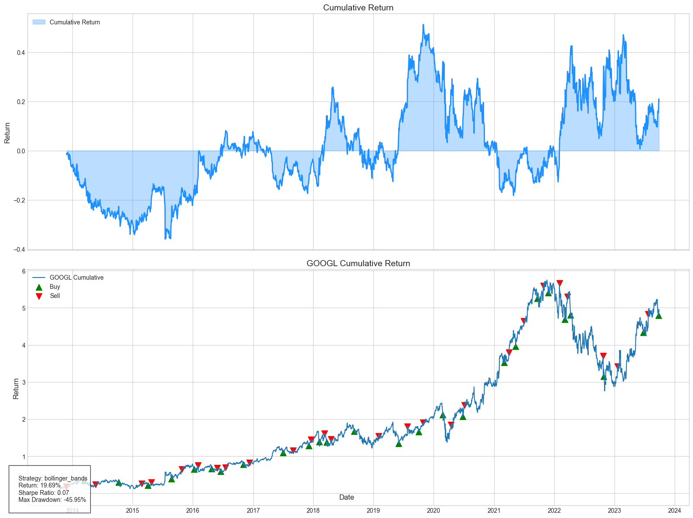

[](https://github.com/Naereen/StrapDown.js/blob/master/LICENSE)
[](http://makeapullrequest.com)

<div align="center">
  <picture>
    <source srcset="./tr4der/images/tr4der.png" media="(prefers-color-scheme: dark)" />
    
  </picture>
</div>

<h2 align="center">Algorithmic Trading Library for Quantitative Strategy Ideation</h2>

<p align="center">
<a href="https://github.com/Naereen/StrapDown.js/blob/master/LICENSE"></a>
<a href="http://makeapullrequest.com"></a>
</p>

> Tested on Python 3.10 and later

Tr4der is an algorithmic trading library for quantitative strategy ideation. Using natural language, you can easily generate and backtest trading strategies for specific stocks and ETFs. Tr4der will parse the user's input, retrieve the data, execute code to filter the data, then apply the trading strategy that the user specifies. All of the data is persisted on disk and can be accessed and modified at will.


## Installation


1. **Install the package**

```bash
$ pip install tr4der
```

2. **Set your OpenAI API key**

  ##### Open the file `tr4der/utils/config.py` and set the `openai_api_key` to your OpenAI API key.


## Usage

Examples of valid prompts:
- "I want to pair trade UBER and LYFT over the past 5 years"
- "Go long on the top 5 PE stocks in the Nasdaq"
- "Short the bottom 3 PE stocks in the S&P 500"
- "I want to use a K-nearest neighbors model to trade LYFT stock since their IPO to now"
- "I want to use mean reversion with bollinger bands to trade GOOGL for the past 10 years"

```python
import tr4der

# Define the query
query = "I want to use mean reversion with bollinger bands to trade GOOGL for the past 10 years"

# Pass the query to the Tr4der class
trader = tr4der(query)

# Metric Results
==> 
Start: 2013-10-01 00:00:00
End: 2023-09-29 00:00:00
Duration: 3650 days 00:00:00
Exposure Time [%]: 98.41
Equity Initial [$]: 10000
Equity Final [$]: 11969.02
Equity Peak [$]: 15128.67
Return [%]: 19.69
Return (Ann.) [%]: 1.82
Volatility (Ann.) [%]: 27.76
Sharpe Ratio: 0.07
Sortino Ratio: 0.07
Max. Drawdown [%]: -45.95
Calmar Ratio: 0.04
Avg. Drawdown [%]: -19.45
Max. Drawdown Duration: 1428 days 00:00:00
Avg. Drawdown Duration: 196 days 04:00:00
Trades: 52
Best Day [%]: 9.62
Worst Day [%]: -16.26
Avg. Trade [%]: 0.02
Max. Trade Duration: 3650
strategy: bollinger_bands
```

A plot of the strategy will appear in your console.
<picture>
  <source srcset="./tr4der/images/google_test.png" media="(prefers-color-scheme: dark)" />
  
</picture>


## Supported Strategies

**Most of these strategies are:**
1. Custom implementations of simple strategies (buy & hold)
2. Custom implementations of strategies with technical indicators (MACD, Bollinger Bands, etc)
3. Custom implementations of strategies with machine learning models (linear regression, clustering, etc)

**Please** recognize there are many ways to implement these strategies and results can vary significantly; Reference the code for exact implementation details.


### Simple Strategies
- **Long Only**
  - **Method**: `long(df)`
  - **Description**: Go long on specified tickers.

- **Short Only**
  - **Method**: `short(df)`
  - **Description**: Go short on specified tickers.

- **Long Short**
  - **Method**: `long_short(df, long_tickers, short_tickers)`
  - **Description**: Go long on specified tickers and short on others.

### Technical Strategies
- **Momentum Strategy**
  - **Method**: `momentum_strategy(df, window=5)`
  - **Description**: Calculates momentum based on the rolling mean of returns over a specified window.
  - **Signals**: Buy when momentum is positive, sell when negative.

- **MACD Trend Following**
  - **Method**: `macd_trend_following(df, fast_window=12, slow_window=26, signal_window=9)`
  - **Description**: Uses the Moving Average Convergence Divergence (MACD) indicator for trend following.
  - **Signals**: Buy when MACD line crosses above the signal line, sell when it crosses below.

- **Moving Average Mean Reversion**
  - **Method**: `mean_reversion_moving_average(df)`
  - **Description**: Uses a moving average approach for stationary mean reversion.
  - **Signals**: Buy when price falls below a certain ratio of its moving average, sell when it rises above.

- **Bollinger Bands Mean Reversion**
  - **Method**: `mean_reversion_bollinger_bands(df, window=20, num_std=2)`
  - **Description**: Uses Bollinger Bands for mean reversion trading.
  - **Signals**: Buy when price touches the lower band, sell when it touches the upper band.

- **Pairs Trading**
  - **Method**: `pairs_trading(df)`
  - **Description**: Implements a basic pairs trading strategy using the price spread between two stocks.
  - **Signals**: Buy one stock and sell the other when their price spread deviates significantly from its mean.

### Machine Learning Strategies (Single stock support for now)
- **Linear Regression Strategy**
  - **Method**: `linear_regression(df)`
  - **Description**: Implements a basic linear regression strategy on previous n days returns (n=5).
  - **Signals**: Buy when the current day's return is greater than the predicted return, sell when it is less.

- **SVM Regression**
  - **Method**: `svm_regression(df)`
  - **Description**: Implements a basic SVM regression strategy with multiple technical indicators: SMA_20, SMA_50, EMA_20, EMA_50, RSI_14, and Previous Day Return. You may modify the technical indicators used in the strategy.
  - **Signals**: Buy when the predicted return is positive, sell when it is negative.

- **Decision Tree Regression**
  - **Method**: `decision_tree_regression(df)`
  - **Description**: Implements a basic decision tree regression strategy with multiple technical indicators: SMA_20, SMA_50, EMA_20, EMA_50, RSI_14, and Previous Day Return. You may modify the technical indicators used in the strategy.
  - **Signals**: Buy when the predicted return is positive, sell when it is negative. 

- **Nearest Neighbors Regression**
  - **Method**: `nearest_neighbors_regression(df)`
  - **Description**: Implements a basic nearest neighbors regression strategy with multiple technical indicators: SMA_20, SMA_50, EMA_20, EMA_50, RSI_14, and Previous Day Return. You may modify the technical indicators used in the strategy.
  - **Signals**: Buy when the predicted return is positive, sell when it is negative.

- **Neural Network Regression**
  - **Method**: `neural_network_regression(df)`
  - **Description**: Implements a basic neural network regression strategy with multiple technical indicators: SMA_20, SMA_50, EMA_20, EMA_50, RSI_14, and Previous Day Return. You may modify the technical indicators used in the strategy.
  - **Signals**: Buy when the predicted return is positive, sell when it is negative.

- **LSTM Regression**
  - **Method**: `lstm_regression(df)`
  - **Description**: Implements a basic LSTM regression strategy with multiple technical indicators: SMA_20, SMA_50, EMA_20, EMA_50, RSI_14, and Previous Day Return. You may modify the technical indicators used in the strategy.
  - **Signals**: Buy when the predicted return is positive, sell when it is negative.


## Modifying Strategies

```python
# If you want to use a pre-existing strategy and modify it, save your strategy data
strategy_data = trader.strategy_data

strategy_data.head()

==>

| Date       | GOOGL     | GOOGL_return | GOOGL_ma   | GOOGL_upper_band | GOOGL_lower_band | GOOGL_position |
|------------|-----------|--------------|------------|-------------------|-------------------|----------------|
| 2013-12-05 | 26.459961 | -0.000794    | 25.954617  | 26.861214        | 25.048020        | -1.0           |
| 2013-12-06 | 26.773523 | 0.011850     | 26.032095  | 26.940630        | 25.123559        | -1.0           |
| 2013-12-09 | 26.980480 | 0.007730     | 26.109810  | 27.064833        | 25.154786        | -1.0           |

#Call strategy with modified parameters
trader.MachineLearningStrategies.nearest_neighbors_regression(strategy_data, technical_indicators=['SMA_20', 'SMA_50'])
```

## Dependencies

- Python 3.10+
- OpenAI API
- pandas
- numpy
- scikit-learn
- tensorflow (for LSTM strategy)
- matplotlib (for plotting)

## Contributing

Contributions are welcome! Please feel free to submit a Pull Request.

1. Fork the repository
2. Create your feature branch (`git checkout -b feature/AmazingFeature`)
3. Commit your changes (`git commit -m 'Add some AmazingFeature'`)
4. Push to the branch (`git push origin feature/AmazingFeature`)
5. Open a Pull Request

## Version

Current version: 1.0.0

## Contact

Sean Mullins - [LinkedIn](https://www.linkedin.com/in/smullins998/) - [Email](mailto:smullins998@gmail.com) - [GitHub](https://github.com/smullins998/tr4der)


## Disclaimer

This project is for educational purposes and ideation only. The author is not responsible for any financial losses incurred as a result of using this software. Always perform thorough analysis and risk assessment before using any trading strategy with real capital.
